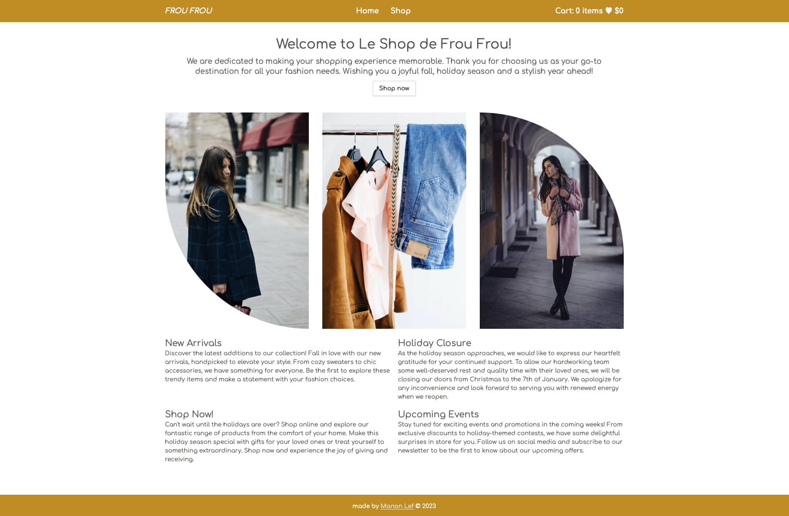

# Shop Website Project

## Preview

[Try the Website live here](https://shopping-cart-manonlef.vercel.app)

## About this project / Objectives

We needed to create a basic SPA Shop website. 
The requirements:
- [x] at least two pages: home and shop
- [x] header with cart items
- [x] same navigation bar on all pages
- [x] individual product cards
- [x] fetch items for shop from a store API like `FakeStore API` or similar
- [x] cart items, amount have to adjust when user adds items
- [x] user should be able to input or adjust amount to add to cart
- [x] test using the React Testing Library
- [x] deploy correctly so the site routing is handled correctly for a SPA

## Challenges I encountered during this project

I have left some [notes in the repo](./notes/notes.md) and I will write some more here soon: about

### TDD

### Hierarchy for lifting state with Router

### Testing with fetch / MSW

## To-Do's

- [ ] mobile responsiveness
- [ ] make it more clear item goes into cart
- [ ] add delete button in cart
- [ ] possibly add edit option for amount in cart
- [ ] add tests after looking through similar projects for test ideas and practice
- [ ] accessibility
  - [ ] semantic elements
  - [ ] alt text
- [ ] consider local storage for returning visitors
- [ ] refactor elements and functions as needed
- [ ] add an actual error page
- [ ] add a loading page

## image credits

- "woman holding brown leather bag in bokeh photography" by [Alexandru Zdrobău via Unsplash](https://unsplash.com/photos/woman-holding-brown-leather-bag-in-bokeh-photography-juESZxMhtXk)
- "women's four assorted apparel hanged on clothes rack" by [Alexandra Gorn via Unsplash](https://unsplash.com/photos/womens-four-assorted-apparel-hanged-on-clothes-rack-WF0LSThlRmw)
- "woman holding scarf with cross legs in between of gray concrete wall"[freestocks via Unsplash](https://unsplash.com/photos/woman-holding-scarf-with-cross-legs-in-between-of-gray-concrete-wall-8hAsLeE6Fbo)
- "clothing rack with brown coat" [Chris Reyem via Unsplash](https://unsplash.com/photos/brown-coat-hanged-on-white-plastic-hanger-oJoeGnj8OMM)